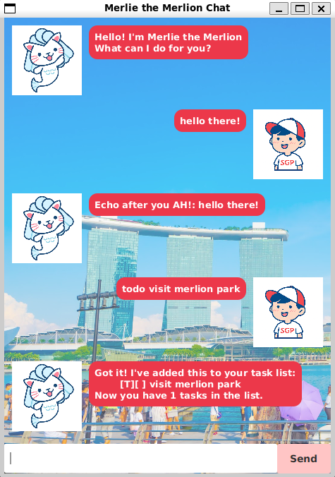
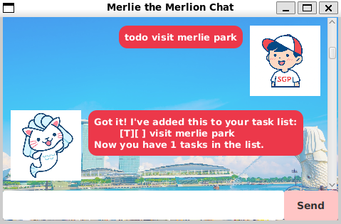
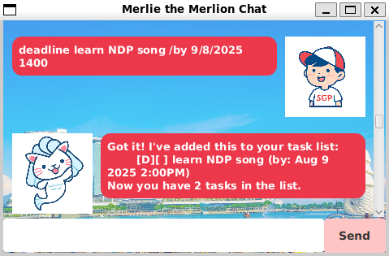
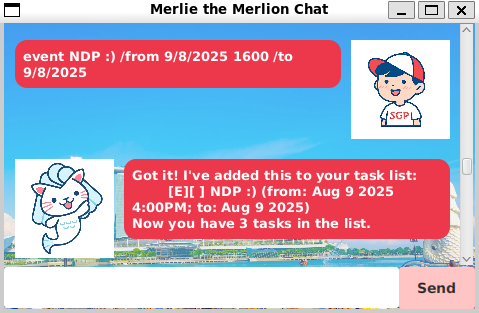
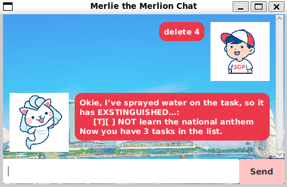
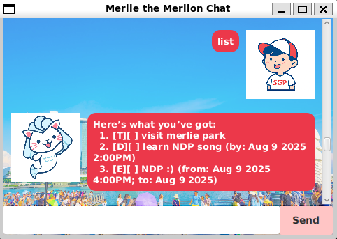
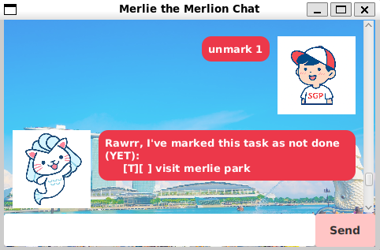
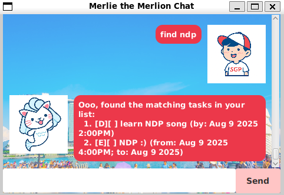
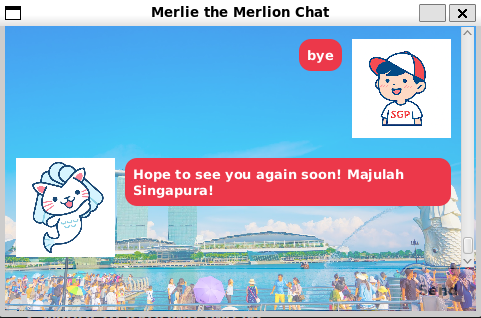

# Merlie the Merlion Chat User Guide 🦁💬

  

🦁 Merlie is a friendly Singapore task management chatbot designed to help you keep track of your to-dos, deadlines, and events.  

<br>

## 🏃Quick Start
1. Download the latest release (v0.3) .jar file
2. Copy the file to the folder you want to use as the home folder for Merlie the Merlion Chat
3. Open a command terminal and cd into the folder with the JAR file
4. Enter `java -jar Merlie.jar` to run the application

<br>

## 📝Adding Tasks
There are 3 types of tasks you can add to your list
- [x] Todo
- [x] Deadline
- [x] Event

### Todos: `todo`
Add a simple **todo task**  to your task list!

  

```
todo <description>
```
<br>

Example: `todo visit merlie park`
```
Got it! I've added this to your task list:
    [T][ ] visit merlie park
Now you have 1 tasks in the list.
```
Merlie adds "visit merlie park" as a todo task to your list of tasks!

---

### Deadlines: `deadline`
Add a **deadline** you need to complete to your task list!

  

```
deadline <description> /by <d-M-yyyy> (<HHmm>)
```
Other acceptable date formats:
- yyyy-MM-dd
- d/M/yyyy

<br>

Example: `deadline learn NDP song /by 9-8-2025 1400`
```
Got it! I've added this to your task list:
    [D][ ] learn the NDP song (by: Aug 9 2025 2:00PM)
Now you have 2 tasks in the list.
```
Merlie adds "learn the NDP song" with the date and time of deadline to your list of tasks!

---

### Events: `event`
Add an **event** you want to (or need to...) attend to your task list!

  

```
event <description> /from <d-M-yyyy> (<HHmm>) /to <d-M-yyyy> (<HHmm>)
```
Other acceptable date formats:
- yyyy-MM-dd
- d/M/yyyy

<br>

Time can be included in
- Both dates
- Either dates
- Neither dates

<br>

Example: `event NDP :) /from 9/8/2025 1600 /to 9/8/2025`
```
Got it! I've added this to your task list:
    [E][ ] NDP :) (from: Aug 9 2025 4:00PM; to: Aug 9 2025)
Now you have 3 tasks in the list.
```
Merlie adds "NDP :)" with the event date and time to your list of tasks!

<br>

## 🗑️ Deleting Tasks: `delete`
Remove a task from your list whenever it’s no longer needed.

  

```
delete <task number on the list>
```

<br>

Example: `delete 4`
```
Okie, I've sprayed water on the task, so it has EXTINGUISHED...:
    [T][X] NOT learn the national anthem
Now you have 3 tasks in the list
```

<br>

## 📜Listing Tasks: `list`
You can view all your tasks anytime!

  

To view your task list, enter `list`

```
Here's what you've got:
    1. [T][ ] visit merlie park
    2. [D][ ] learn NDP song (by: Aug 9 2025 2:00PM)
    3. [E][ ] NDP :) (from: Aug 9 2025 4:00PM; to Aug 9 2025)
```

<br>

## ✘ Marking Tasks: `mark` and : `unmark`
You can mark or unmark tasks in the task list to update its status

  


Once you complete a task, you can mark it as done
```
mark <task number on the list>
```

<br>

Example: `mark 1`
```
Congratulations on completing your task:
    [T][X] visit merlie park
```
<br><br>

  

You can also unmark it with the `unmark` command
```
unmark <task number on the list>
```
Example: `unmark 1`
```
Rawrr, I've marked this task as not done (YET):
    [T][ ] visit merlie park
```

<br>

## 🔎Finding Tasks: `find`
You can easily search for tasks with a keyword (single word/phrase)!

  

```
find <keyword>
```

<br>

Example: `find ndp`
```
Ooo, found the matching tasks in your list:
    1. [D][ ] learn NDP song (by: Aug 9 2025 2:00PM)
    2. [E][ ] NDP :) (from: Aug 9 2025 4:00PM; to Aug 9 2025)
```

<br>

## 👋😟Ending the Chat: `bye`
Once you are done managing your tasks, you can close the GUI by sending `bye`

  

You can always resume by relaunching the JAR file 😁👍